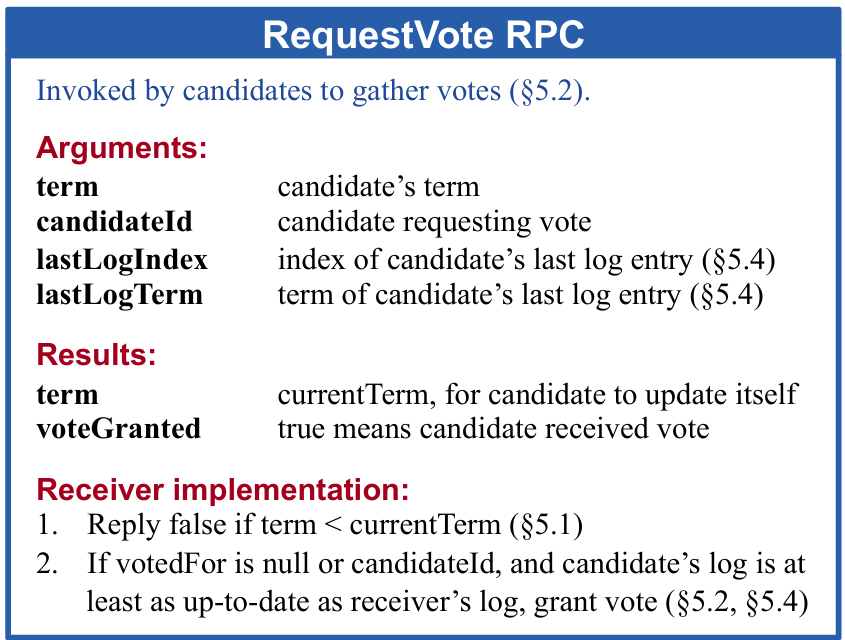

## Lab 1
尝试完成worker.go 代码主要负责向coordinater请求任务并执行。请求任务使用doHeartbeat(),并根据返回结构体中JobType 字段来决定执行什么任务

定义mr/rpc.go 中 HeartbeatResponse结构体，首要存储的内容是Id和JobType，根据JobType不同决定存入的其他字段是否有效
在util.go中定义JobType类型，同时定义任务类型常量块，使用iota初始化第一个常量，后续生成自增值

mr/worker.go doHeartBeat()函数，通过call()方法调用Coordinator.Heartbeat方法，传入构造的resp地址，获得返回值

继续完成worker根据不同HeartBeatResponse.JobType 调用的不同函数，包括doMap,doReduce,Wait和Complete

go的变量命名：
    变量名 类型名
go的函数名：
    函数名 func(参数类型) 返回值类型
make函数：
    make(chan int,[buffer_size])
    make(map[string]int){'key':1,...}
    make([][]int,5)


在doMap方法中，首先读入文件获得文件内容content并处理相关异常，再使用mapf函数处理，该方法返回 KeyValue结构体数组，

rules中指明map阶段需要将intermediate keys分入nReduce个bucket中（后续使用nReduce个reduce任务处理intermediate keys），同时每个map任务应该创建nReduce个intermediate文件

为每个bucket创建一个goroutine，每个goroutine将待存入这个bucket内的intermediate中的kv写入本地文件

make构造intermediate变量，类型为二维数组，D1作为nReduce_Bucket号，D2内append多个KeyValue对象

`var wg sync.WaitGroup`定义了一个WaitGroup对象，用于等待所有的goroutine完成，内置了计数器对象，wg.Wait()方法会阻塞，直到wg内置counter为0

`defer wg.Done()`用于在方法完成后减少wg计数器，TODO::思考在函数结束时直接调用wg.Done()和这种方式有什么区别？--defer方法确保了异常返回时也能调用wg.Done()而且避免了函数返回时忘记调用wg.Done()的情况。

使用:=声明局部变量，var声明全局/包级变量

fmt.Println/Printf()打印到标准输出，Sprint()返回格式化后的字符串,不打印到标准输出

Sprint和Sprintf --前者concat参数并返回，后者类似printf

%v是什么/%+v/%#v --自动选择输出类型，基本类型直接输出，复合类型输出易于阅读格式，自定义接口如果有Stringer方法则调用该方法;%#v：以 Go 语法表示值。%+v：对于结构体，包含字段名和值。%#v：对于结构体，包含字段名和值，并且使用 Go 语法表示

String()方法 --Stringer/Error/io.Reader/Writer/Closer/xxx等，都属于go语言内置接口

go func(xxx){

}(params) 用于自定义匿名函数调用

新建atomic.go存放原子操作
    实现原子写文件操作 --先写入临时文件再调用os.Rename()原子替换

>接收者:
`func [Receiver] [MethodName](args ...) (results ...){...}`通过指定接收者将方法与类型绑定起来（GO语言没有类）

doReport()方法
    用到了SchedulePhase和ReportReq&ReportResp结构体,结构体在rpc.go里，SPhase在util.go里，通过call函数RPC调用Coordinator中的Report函数

Coordinator.go/Report()&Heartbeat():
    先定义了coordinator.go/Task和Utils.go/TaskStatus, 又定义了heartbeatMsg和reportMsg
    Heartbeat():这里参数中传了一个空的Request struct，感觉没用？？TODO::检查HeartbeatReqest作用，没用就删了；在coordinator中，heartbeat函数把resp地址放入heartbeatCh中，然后等待msg.ok通道的信号（猜测这里用的是没有缓存的channel）这边是一个生产者消费者模型，消费者部分在schedule中实现
    推测同步机制是 Report/Heartbeat函数先将msg发送到Coordinator对应channel，然后执行流程交给其他函数（initPhase，schedule等），其他流程在完成时会在msg.ok这个channel里面塞一个struct，然后把执行流程交会Heartbeat，在其他流程执行过程中，由于resp地址塞到msg中，所以其他流程应该往里面写入了合适的数据；Report函数流程应该类似


doReduce():
    找一下nMap这个数字是哪里来的？写数据好像都在selectTask里面
    main/mrcoordinator.go中调用了MakeCoordinator(),这个函数的impl在coordinator里，这里展示了nMap是如何初始化的：根据需要coordinator处理的文件数初始化nMap；
    这里顺便完成下makeCoordinator这个函数
    考虑下nMap这个参数是干嘛的？？？

先写coordinator:

~~selectTask:
    1. 在task中维护开始时间和fileName
    2. 每次调用时检查一遍coordinator中的所有任务，如果闲置就根据coordinator的阶段分配MapTask/ReduceTask
    3. 如果Working中就检查是否超时，超时则根据当前阶段重新分配当前任务到worker
    4. Coordinator 分为3个调度阶段，MapPhase, ReducePhase, WaitPhase~~

Coordinator主要有三个目标，分配任务，状态管理，阶段切换
主要调度循环逻辑在schedule方法里：
任务流程应该是Map->Reduce->Done,所以先initMapPhase，该函数将codntor阶段改为MapPhase，然后把tasks填充起来
然后开一个死循环，使用switch 等待heartbeatCh/reportCh的信号
1. heartbeatCh 
    这里应该是worker向coordinator发送心跳，coordinator根据worker的状态，分配任务，返回结果
    要根据当前coordinator的阶段，分配任务，返回结果
    如果已经进入CompletePhase，就把CompleteJob写入resp的JobType类型然后在msg.ok写入空结构体发送信号，切换到worker.go/Worker函数执行，会return结束这个go routine.
    当非CompletePhase时，由于coordntor处理heartbeat的函数向hrtbtCh里写入请求消息（该消息携带一个resp地址和okch）
    此时， 取出hrtbtMsg,调用selectTask函数为该worker分配任务,根据selectTask方法返回情况，若该函数返回True表示当前阶段所有任务已经全部完成，返回False表示还有任务未完成;
    返回False时，向msg.ok中传入空结构体信号，切换到cordnator/Heartbeat执行->worker.go/doHeartbeat -> worker.go/Worker逐层返回，然后worker可以根据resp中存入的信息继续执行。
    //TODO:: 返回True时？
2. selectTask:
    该函数接受的参数中包含一个resp地址用于写入参数给worker使用
    功能上，该函数遍历coodnator的task列表，检查每个任务状态，闲置则启动，工作则检查超时；--每次hartbeat时才检查任务是否超时，所以只能保证在有新worker可用时分配一个已超时任务
    当检查到第一个闲置任务时，向当前resp中写入该任务相关参数，终止遍历task列表
    调用顺序如下：
        1. 从mrworker.go 启动worker
        2. worker doheartbeat()
        3. coordinator schedule() switch监听heartbeatCh, 在非CompletePhase时，把hrtbtMsg中的resp地址传入selectTask为当前提出hartbeat的worker分配任务
Coordinator全部完成
回到worker
在initReducePhase的时候，向coordinator.Tasks中插入了nReduce个任务，代表需要nReduce个go routine的reduce任务，每个reduce任务处理一个nMap个intermediate文件(回忆一下shuffle过程)
如何解释NMap（len(files)）呢？
--在initMapPhase中，将files中的文件名作为map任务的参数，然后启动nMap个map任务，每个map任务处理一个文件；在每个map任务中，把mapf的结果按照ihash()%nReduce出的index存放到nReduce个intermediate列表中，每个列表生成临时文件存储中间结果。

总体来说，我的Lab 1实现是Event-driven的，在worker中发送hrtbtRequest，coordinator每次收到request后根据内部存储的task信息做出响应，返回相应数据调度worker工作。
如果期待更高的并发量的话，可以使用多线程的coordinator，一种可能的实现是在每次heartbeat时起一个新的coordiator线程，互斥访问tasks数组（或者干脆把tasks数组做类似数据库分页操作，减少互斥访问）


## Lab 1.5 GO's RPC framework

mainly using net/rpc package

Client:
```
c,err := rpc.DialHTTP("unix", coordiantorSock())
if err != nil{
    ...
}
defer c.Close()
err = c.Call(rpcName, args, reply)
```
Server:
```
func(c *rpc.Client) server(){
    rpc.Register(c)
    rpc.HandleHTTP()
    l, e := net.Listen("unix",coordinatorSock)
    go http.Serve(l, nil)
}
```
---------------------------------------------------------------------------------
## Lab 2
这里出了点问题，Pull的代码是6.5840 2024 Spring的最新代码 ，看的课以及Schedule还是2020的旧版本，
检查了一下，2020-lab-2A对应leader election, 2020-lab-2B对应append new logs, 2020-lab-2C对应persistent, 这些和2024-lab-3的前三个实验内容一致，不一样的是2024-lab-3D新增了Log Compaction的内容并且标记为Hard难度，这样的话就先实现前三个内容（因为有参考hhh），3D的内容尽力吧

标记一个优雅的可视化Raft[https://thesecretlivesofdata.com/raft/]

标记一个做前必读[https://thesquareplanet.com/blog/students-guide-to-raft/]


### Lab 2A
这节主要关注Leader Election部分，关注两个功能：
1. Election --包括超时/请求投票/投票等
2. 保活   --主要包括hrtbeat

在util中定义type Entry struct，暂时还不清楚放什么
新建rpc.go存放rpc Request和Response结构体 --注意Go的RPC框架只允许结构体属性首字母大写，否则无法识别，2A的Hints中同样注明:[Go RPC sends only struct fields whose names start with capital letters. Sub-structures must also have capitalized field names (e.g. fields of log records in an array). The labgob package will warn you about this; don't ignore the warnings.]

定义rpc.go/AppendEntriesRequest和AppendEntriesResponse

在Raft算法中抽象出一个Term概念，每次更换Leader的时候Term自动+1，相当于纪元，活在上个纪元的人发来的消息不必理会：)

每个节点内部维护一个自己的Term，如果收到其他节点的AppendEntriesRequest中Term更小代表发送这条消息的节点已经过时了。 

`RequestVote`方法由candidate发起，向其他节点收集投票信息；



具体实现上，使用到了Raft节点内的以下状态信息：
1. state，记录Follower/Candidiate/Leader
2. currentTerm，记录term信息
3. votedFor，记录当前节点投票信息
其余涉及的timer/存储的perr信息等忽略不计

在RequestVote函数中，先锁定当前节点，然后判断请求是否来自已过时的节点，再判断是否已经投票；如果请求来自过时节点或者已经投票，则在resp中VoteGranted写入false

>思考：作为一个共识算法，应用场景是一个多节点集群，每个节点自主管理自己的状态，并通过rf.mu来保证避免数据竞争；集群中的所有节点只有三种身份：Follower、Candidate、Leader；Follower计时器超时后成为Candidate，并向其他节点发送RequestVote，竞选Leader；

思考一下为什么var一个 globalRand而不是每次都rand.Int(),这样有什么好处？//TODO::先放一个每次randInt试试，如果出了问题再改

首先，每个Raft节点应该有一个后台ticker go routine, 负责控制计时器触发后对应的动作；

>func (rf *Raft)StartElection():函数应该向每个集群内每个RaftNode发送RequestVote,等待回答,如果超出半数的yes,则成为Leader,否则重新发起选举;

选举流程中，Term只在Follower->Candidate转换时自增， Candidate->Leader时，Term不变

思考一下为什么StartElection函数外层判断使用req.Term与rf.currentTerm判断，内层才判断resp.Term与rf.currentTerm --在代码注释中已给出

最后，记录一下出问题的地方： Boardcast()时for循环中同步请求，Call未定义超时策略，导致程序卡死；解决方案： go rf.peer[idx].Call(xxx),异步处理，发出去拉倒，不管你收没收到

### Lab 2B
2B关注点在日志同步中，Raft集群Leader发出同步请求，Follower接受同步请求，回复ACK；Leader在收到多数Follower的ACK后，Apply日志并标记commited，通知Follower apply该日志


关于Leader发送AppendEntries RPC调用的思考，现有代码如下：
```
func (rf *Raft) Start(command interface{}) (int, int, bool) {
	// Your code here (3B).

    // ignore code doesn't matter
    newLog := Entry{Command: command, Term: rf.currentTerm}
    ...
    (construct a new log Entry and append it to rf.logs)

	// broadcast AppendEntries RPC call to all followers
	req := new(AppendEntriesRequest)
	req.Term = rf.currentTerm
	req.LeaderId = rf.me
	req.PrevLogIndex = lastLog.Index
	req.PrevLogTerm = lastLog.Term
	req.LeaderCommit = rf.commitIndex
	req.Entries = []Entry{newLog} // TODO:: send one entry once? -> send more maybe
	for peer := range rf.peers {
		if peer == rf.me {
			continue
		}
		// send AppendEntries call to all followers and wait for reply
		// need a timeout mechanism, when triggered, send again until receive all nodes reply

		// mutex to lock respCounter
		respCounterMu := sync.Mutex
		respCounter := 0
		go func(peer int) {
			resp := new(AppendEntriesResponse)
			rf.peers[peer].Call("Raft.AppendEntries", req, resp)
			rpcTimer := time.NewTimer(time.Duration(RPCTimeout) * time.Millisecond)
			for {
				select {
				case <-resp.ok:
					// received from RPC call
					respCounterMu.Lock()
					respCounter += 1
					respCounterMu.Unlock()
					rpcTimer.Stop()
					return
				case <-rpcTimer.C:
					rf.peers[peer].Call("Raft.AppendEntries", req, resp)
					rpcTimer.Reset(time.Duration(RPCTimeout) * time.Millisecond)
				}
			}
		}(peer)
		// think about situation:
		// COMMAND 1 -> leader, leader boardcast AppendEntries RPC call
		// received majority resp, commited COMMAND 1.
		// Node x still respond, COMMAND 2 -> leader at that time.
		// Leader would have to notify node X with req{COMMAND 1;COMMAND 2}

	}
	return newLog.Index, newLog.Term, true
}
```
上面的代码执行流程如下： Leader收到Client请求COMMAND1，调用Start(COMMAND1)函数尝试写入日志；Start方法内部构造新的Log Entry并Append到Leader节点的logs中，然后构造AppendEntriesRequest{COMMAND1}发送广播到所有的Follower，如果所有节点都在RPCTimer超时前返回(即<-resp.ok)，则流程正常结束；假定NodeX(Follower)发生内部错误或者网络延迟，RPC调用超时，假设此时Majority已完成，Leader节点commitedIndex=COMMAND1.Index，同时Client发送COMMAND2请求，那么下次向NodeX发送AppendEntries RPC调用时, 应该构造一个AppendEntriesRequest{COMMAND1, COMMAND2}，而不是AppendEntriesRequest{COMMAND2},因为这样不仅效率更高，而且能保证NodeX在丢失AppendEntriesRequset{Command1}数据包的情况下维护coherence.

由于需要为每个peer节点维护一个已确认状态信息，可以考虑在Leader创建时，为每个peerNode创建一个go routine,记录对应node回应信息

由于全局log一致，使用Entry内index作为唯一标识